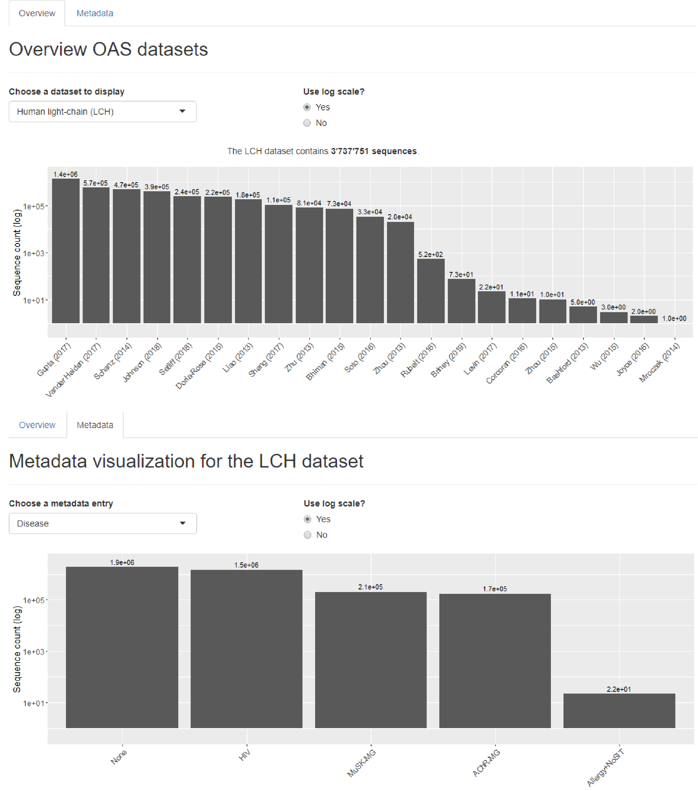

# Visualization of the Observed Antibody Space
The Observed Antibody Space is an Ig-seq collection from 58 experiments, covering over half a billion sequences. This effort was undertaken by Aleksandr Kovaltsuk et al., in The Journal of Immunology October 15, 2018, 201 (8) 2502-2509.

The goal of this Shiny application is to visualize the dataset together with its metadata. In the following, the different parts of the app are summarized.

------------

## Overview

Barplot visualization of sequences found in all of the separate studies. At the top, the total number of sequences in the currently selected dataset is shown. If the numbers, specificying the sequence count separately for each study, overlap on top of the bars, make the application window larger.

## Metadata

Visualization of different metadata entries as bar plots, again with the number of sequences shown above each bar. Currently, this only works for human light-chain sequences; the rest will be added at a later point.

## Usage

In RStudio, open either server.R or ui.R, and press the button 'Run App', found at the top right of the script window.

In R, change to the directory with the aforementioned files, and run the command runApp().

## Required packages

shiny, shinycssloaders, dplyr, ggplot2

Those can be loaded with the command library('package').

------------

